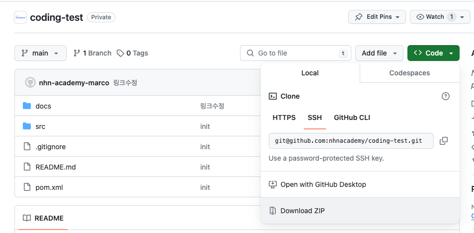

# JAVA 백엔드 개발 과정 선발 시험

## 준비
* Download ZIP을 클릭하여 압축을 해제 합니다.
* 개발도구를(IntelliJ or Visual Studio Code) 사용하여 프로젝트를 오픈합니다.

## 유리수 계산기를 만들어 봅니다
* 유리수와 4칙 연산[ +, -, *, / ], 괄호 [ (, ) ]의 조합을 입력으로 받습니다.
* 연산 기호 우선의 우선순위에 따라 계산합니다.
* 유리수를 클래스로 정의합니다.
* 유리수의 분수 표현은 변경될 수 있습니다.
* RPN(Reverse Polish Notation) 계산기를 이용해 계산합니다.

## 문제

### [1.유리수](./docs/01.유리수.md)
### [2.유리수 연산](./docs/02.유리수-연산.md)
### [3.유리수 추가연산](./docs/03.유리수-추가연산.md)
### [4.정수 계산기](./docs/04.정수-계산기.md)
### [5.유리수 계산기](./docs/05.유리수-계산기.md)

## 테스트
* Junit5를 활용하여 작성한 코드를 검증할 수 있습니다.
* 또는 직접 [Main.java](src/main/java/com/nhnacademy/Main.java) 파일에서 직접 실행하고 검증할 수 있습니다.

## 제출

* 모든 파일을 zip으로 묶어서 제출합니다.
  * `target` Directory는 제외합니다.
* 제출은 아래의 이메일로 합니다.
  * nhnexam@gmail.com
  * 이메일 제목은 "학교-성명"입니다.
